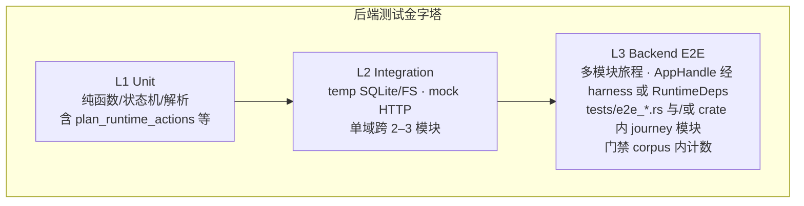
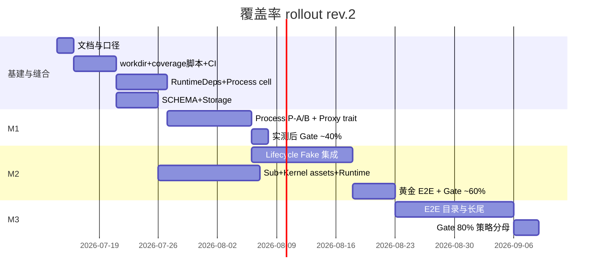
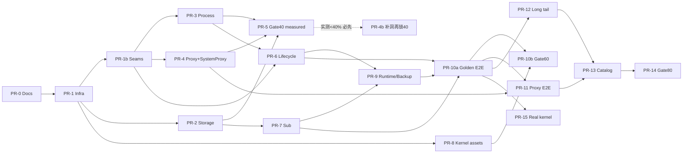

# 后端测试覆盖率提升至 80% + E2E 计划

| 字段 | 值 |
|------|-----|
| **文档标题** | Backend Test Coverage Plan to 80% + E2E |
| **作者** | TBD |
| **日期** | 2026-07-09 |
| **状态** | Ready for implementation（rev.3 — Open Questions 已关闭） |
| **目标仓库** | `sing-box-windows`（Tauri 2 + Vue 3 + Rust） |
| **目标路径** | `src-tauri/` |
| **基线测量** | 2026-07-09，`cargo-llvm-cov --lib`（排除 `*.tests.rs`）≈ **26.4% line** |
| **门禁测量** | **非 `--lib`**：`scripts/coverage-backend.sh`（lib 单测 + `tests/*` 集成/E2E 一并计入） |
| **建议落盘** | `docs/backend-test-coverage-plan.md` |

---

## Overview

当前 `src-tauri` 在 **`--lib` 口径**下约 **26.4%** 行覆盖（约 14700 行分母 / Missed 10821；约 150 个 lib 单测，数量为约数）。高覆盖集中在纯函数域（`custom_rule`、`config_generator`、`state_model`、`log_rotation` 等）；代理运行时、内核生命周期、进程管理、SQLite、订阅与托盘等关键路径近乎为零。

本设计（rev.2）修正了 rev.1 中几处会阻断实施的问题：

1. **覆盖率门禁必须与 E2E 同源计数**——门禁用全量测试（含 `tests/e2e_*.rs`），不再用 `cargo llvm-cov --lib` 作为 80% 依据。
2. **明确 AppHandle / `PROCESS_MANAGER` / 存储单例的可测缝合图**，而不是假设 “调 internal API 即可跑通旅程”。
3. **进程抽象对齐真实 `ProcessManager` 签名**，并给出 `PROCESS_MANAGER` 全局替换的分阶段 cutover。
4. **里程碑行预算自下而上**；80% 对 **策略分母（policy denominator）** 生效，并列出承诺不计入/难覆盖薄壳。

目标仍是：**生产代码行覆盖率 ≥ 80%（策略分母）+ hermetic 后端 E2E**，CI 渐进门禁，PR 可独立合并。

---

## Background & Motivation

### 当前状态

| 维度 | 现状 |
|------|------|
| 测试风格 | 内联 `#[cfg(test)]` 与 sibling `#[path = "foo.tests.rs"]`（约 17 个 sibling 模块） |
| 命令 | `cd src-tauri && cargo test`；几乎无前端单测 |
| CI | 仅 release 构建（`.github/workflows/release.yml`），**无 coverage gate** |
| 回归手段 | `pnpm type-check` + Rust 测试 + 人工 QA |
| 架构测试 | `app/architecture.tests.rs`：storage 不得依赖 kernel/network/runtime；auto-manage 须走 `runtime::orchestrator` |
| 全局耦合 | `lazy_static PROCESS_MANAGER: Arc<ProcessManager>`（`kernel_service.rs`）；storage 经 `app.state::<Arc<OnceCell<…>>>()`；多命令强制 `AppHandle` |

### 痛点

1. **热点零覆盖**：`proxy_service.rs`、`process/manager.rs`、`lifecycle.rs`、`database.rs` 等直接影响可用性。
2. **可测性不足**：工作目录硬编码、全局进程管理器、AppHandle 贯穿、HTTP/sudo/OS 代理硬耦合。
3. **E2E 缺失**：无法在 CI 验证「订阅 → 物化 → runtime 编排 → 启停内核」。
4. **口径风险**：测试源计入会虚高；**仅 `--lib` 会使 `tests/e2e_*` 对 80% 零贡献**（rev.1 致命缺陷）。

### 已有可复用资产

- 纯逻辑：`config_generator`、`settings_patch`、`parser`、`plan_runtime_actions`（`runtime/change.rs` 已有单测——**快速覆盖增益**）。
- Mock 模板：`subscription_service/mode.tests.rs`（`TcpListener` + `create_temp_dir`）。
- Internal 先例：`db_save_app_config_internal` / `db_get_app_config_internal`。

---

## Goals & Non-Goals

### Goals

1. **策略分母下行覆盖率 ≥ 80%**，门禁命令与 E2E **同一 corpus**。
2. **Hermetic 后端 E2E**（≥15 条真·多模块旅程 + 若干 L2 集成），无外网、无真实 sudo、默认无真实系统代理。
3. **CI 渐进门禁**：report-only → 实测达标后再设 40/60/80 required check。
4. **最小侵入可测化**：按需端口注入；禁止 big-bang IoC。
5. **保持并扩展架构边界测试**。

### Non-Goals

1. 完整 WebView/Playwright UI E2E（后续可选 track）。
2. 前端 80% 覆盖。
3. 100% 覆盖真实 TUN/真 sudo/真 OS 系统代理。
4. 推翻 `runtime` 重构分层。
5. 将 `*.tests.rs` 计入 80% 分母。

---

## Coverage Definition

### 主指标与门禁命令（Key Decision D-COV）

| 项 | 值 |
|----|-----|
| Metric | **Line coverage**（辅助观察 function/region，不设门禁） |
| **门禁命令** | `scripts/coverage-backend.sh` → **全量** `cargo llvm-cov`（**不加 `--lib`**）+ `--features test-util` |
| 测试 corpus | `#[cfg(test)]` / sibling `*.tests.rs` **与** `src-tauri/tests/**`（含 e2e） |
| 快速本地反馈 | `cargo llvm-cov --lib --features test-util`（**仅开发**，不可用于宣称 80%） |

```bash
# scripts/coverage-backend.sh（权威入口；CI 与本地门禁必须走此脚本）
#!/usr/bin/env bash
set -euo pipefail
ROOT="$(cd "$(dirname "$0")/.." && pwd)"
cd "$ROOT/src-tauri"

# SSOT：任何 ignore 变更只改本脚本（+ 同步本文档本节），PR 需 CODEOWNERS 审
# 路径形态以 PR-1 首次 HTML 中的 filename 为准微调（绝对/相对/含 src-tauri 前缀）
readonly DEFAULT_IGNORE='(\.tests\.rs$|/tests/|test_support/|e2e_tests\.rs$|types/generated/|(^|/)src/lib\.rs$|(^|/)src/main\.rs$|utils/proxy_util\.rs$)'
COVERAGE_IGNORE_REGEX="${COVERAGE_IGNORE_REGEX:-$DEFAULT_IGNORE}"
# 默认 0 = report-only（与 PR-1 一致）；PR-5 起通过 env/repo variable 设为 40/60/80
# 切勿在 PR-5 前把脚本默认改回 40，否则本地裸跑会与「先报告后锁门」冲突
FAIL_UNDER="${COVERAGE_FAIL_UNDER:-0}"

if [[ "${FAIL_UNDER}" == "0" ]]; then
  echo "[coverage-backend] report-only: COVERAGE_FAIL_UNDER=0 (set to 40/60/80 to enforce gate)"
fi

cargo llvm-cov --features test-util \
  --fail-under-lines "${FAIL_UNDER}" \
  --ignore-filename-regex "${COVERAGE_IGNORE_REGEX}" \
  --html --output-dir target/llvm-cov/html \
  --lcov --output-path target/llvm-cov/lcov.info
```

> **为何不能用 `--lib` 作为 80% 门禁**  
> `cargo llvm-cov --lib` 只跑库内单测，**不执行** `tests/e2e_*.rs`。生产代码被 E2E 命中的行**不会**进入覆盖率。rev.1 把 ~2.5k 缺口寄托在 E2E 上，与 `--lib` 门禁矛盾。  
> **全量 llvm-cov** 会编译并运行 integration test binary，对 `app_lib` 插桩后的命中**计入**同一 LCOV。

### 基线与重测

| 口径 | 状态 |
|------|------|
| 2026-07-09 `--lib` 基线 | ~26.4%（Lines≈14700, covered≈3879） |
| 全量 corpus 基线 | **PR-1 合并后必须重跑** `scripts/coverage-backend.sh` 记为 `BASELINE_FULL`；分母应接近（同 lib 插桩），covered 可能略高若已有 integration tests（当前几乎没有） |

下文里程碑预算仍以 **14700 / 3879** 为规划锚点；**设 required check 前必须以实测 HTML 为准**，不得按表格纸面加总硬开闸。

### 策略分母（Policy Denominator）

**Success Criterion #1 的 80% = llvm-cov line % after `DEFAULT_IGNORE`（脚本 SSOT）。**

```text
# 操作定义（与脚本一致，无第二套手工扣减表）
policy_line_% = lines_covered / lines_instrumented   # 均在 ignore-filename-regex 过滤之后

# 「wont-cover」= 必须写进 DEFAULT_IGNORE 的路径，而不是事后口头扣分母
# residual miss 预算 = 过滤后仍 instrumented、但允许未覆盖的难测 OS 边角（不进 ignore）
```

#### 计入（必须覆盖逻辑；未被 DEFAULT_IGNORE 排除）

- `src/app/**`（core / network / system / storage / runtime / singbox / tray / constants）
- `src/process/**`
- `src/entity/**`
- `src/utils/**`（**除** `proxy_util.rs`，见 D-PROXY-SHELL）
- `src/error.rs`、当前平台的 `platform/*.rs`（Linux CI 上仅为 `linux.rs` + `mod.rs` 转发）

#### DEFAULT_IGNORE（工具层过滤 — 与 `scripts/coverage-backend.sh` 字节级一致）

**AC1 最小忽略集（禁止再扩张到 process/proxy/lifecycle 等业务模块）：**

```text
(\.tests\.rs$|/tests/|test_support/|e2e_tests\.rs$|types/generated/|(^|/)src/lib\.rs$|(^|/)src/main\.rs$|utils/proxy_util\.rs$)
```

| 模式 | 对应决策 |
|------|----------|
| `\.tests\.rs$`、`/tests/`、`test_support/`、`e2e_tests`、`types/generated/` | D1 / 测试夹具不计入 |
| `(^|/)src/lib\.rs$`、`(^|/)src/main\.rs$` | **D-LIB** |
| `utils/proxy_util\.rs$` | **D-PROXY-SHELL**（OS 系统代理壳） |

`app/**`（含 proxy_service、lifecycle、materializer）、`process/**`、`platform/**` 等**必须计入**策略分母，靠单测 + hermetic L3 拉升覆盖。

说明：

- **不要**把 `platform/(windows|macos)\.rs` 写进 Linux ignore——它们已是 `#[cfg(target_os=…)]`，**不会编进 Linux lib**（ignore 为 no-op）。
- **唯一权威**：`scripts/coverage-backend.sh` 的 `DEFAULT_IGNORE`；文档本节必须同步；变更走 PR + CODEOWNERS。
- PR-1 产出首份 HTML 后，若 llvm-cov 路径前缀与正则不匹配，**只允许**微调路径锚点（仍须同时改脚本与文档）。

#### 承诺 ignore（wont-cover 路径）vs residual miss（仍 instrumented）

| 符号/区域 | 路径 | 策略 |
|-----------|------|------|
| 启动胶水 | `src/lib.rs`、`src/main.rs` | **DEFAULT_IGNORE**（D-LIB）；`resolve_startup_launch_context` 等已可测逻辑保留在可测模块、**不**靠 ignore 躲业务 |
| OS 系统代理实现 | `utils/proxy_util.rs` | **DEFAULT_IGNORE**（**D-PROXY-SHELL**）；业务只测 `SystemProxy` + Recording 假实现；禁止把分支业务写回 `proxy_util` |
| 真 sudo 校验 shell-out | `sudo_service::validate_sudo_password` | **不 ignore 整文件**；mock 校验端口测加密落盘；真 shell-out 分支占 **residual miss** |
| Tray 创建图标/窗口 | `tray/service.rs` OS 调用段 | 状态机可测；OS 段占 **residual miss**（若拆出 `tray/os.rs` 再评估是否加入 ignore） |
| 进程 `/proc` kill | `platform/linux.rs` | 纯解析可测；真 kill 占 **residual miss** |

**Residual miss 预算（80% 时，已在 DEFAULT_IGNORE 之后）**：

| 项 | 行数约 |
|----|--------|
| 策略分母（规划，ignore 后） | ~14000–14500（以 PR-1/`coverage-backend.sh` 实测为准） |
| 允许 miss @80% | ≤ 0.20 × 分母 ≈ **2800–2900** |
| 难测 OS 边角（sudo validate、tray OS、platform kill 等，**未** ignore） | 预留 **600–1000** |
| 业务代码允许 miss | **≈1800–2300** |

成功标准：**80% after DEFAULT_IGNORE**；ignore 与脚本同源。

### 成功阈值换算（规划锚点）

| 指标 | 数值 |
|------|------|
| 规划总行 | ~14700 |
| 当前已覆盖（--lib 基线） | ~3879（~26.4%） |
| 80% 目标覆盖行 | ~11760 |
| **需新增覆盖** | **~7880 行** |
| 允许剩余 miss | ≤ ~2940（再扣薄壳后业务更紧） |

---

## Test Pyramid



| 层级 | 定义 | 位置 | 计入 80% |
|------|------|------|----------|
| L1 | 无网络、无真实进程、尽量无 AppHandle | `*.tests.rs` / `#[cfg(test)]` | ✅ |
| L2 | temp DB/FS、mock HTTP、Fake process 单模块深测 | sibling 或 `tests/integration_*.rs` | ✅ |
| L3 | 跨 storage→network→runtime→lifecycle 的旅程 | `tests/e2e_*.rs`（**feature test-util**） | ✅（全量 llvm-cov） |

**L3 定义收紧**：必须跨 ≥2 业务域、有可观察副作用（DB/文件/Fake 调用日志/状态快照）。纯静态扫描、纯状态机 **不算 L3**。

Full UI E2E：**out of scope**。

---

## Proposed Design

### 1. 测试基础设施

```text
src-tauri/
├── scripts/../scripts/coverage-backend.sh   # 仓库根 scripts/
├── src/
│   ├── lib.rs          # #[cfg(feature = "test-util")] pub mod test_support;
│   └── test_support/   # 仅 feature = "test-util"，pub，供 tests/* 使用
│       ├── mod.rs
│       ├── temp_workspace.rs
│       ├── runtime_deps.rs    # RuntimeDeps / 组装
│       ├── fake_process.rs
│       ├── fake_http.rs
│       ├── fake_system_proxy.rs
│       ├── event_sink.rs
│       ├── fixtures.rs
│       └── isolation.rs       # 断言 WORK_DIR、禁止污染 HOME
└── tests/
    ├── common/mod.rs
    ├── e2e_storage_backup.rs
    ├── e2e_subscription_runtime.rs
    ├── e2e_kernel_lifecycle.rs
    └── e2e_proxy_custom_rules.rs
```

#### 1.1 Work dir 覆盖（完整）

**两处**均需支持（`utils/app_util.rs`）：

- `get_work_dir_sync`
- `get_work_dir`（async，当前与 sync **重复实现**，必须同步改）

```rust
const WORK_DIR_ENV: &str = "SING_BOX_WINDOWS_WORK_DIR";

fn resolve_work_dir_path() -> PathBuf {
    if let Ok(dir) = std::env::var(WORK_DIR_ENV) {
        let dir = dir.trim();
        if !dir.is_empty() {
            let p = PathBuf::from(dir);
            let _ = std::fs::create_dir_all(&p);
            return p;
        }
    }
    // 既有平台默认…
}
```

**`test_support::TempWorkspace`（强制用于 E2E / 写盘集成测）**：

1. 创建 `tempfile::TempDir`（见 § API 依赖清单：`tempfile` 须声明进 Cargo.toml）。
2. 在 **进程级 `Mutex`（`WORK_DIR_LOCK`）** 下设置/恢复 `SING_BOX_WINDOWS_WORK_DIR`（防止并行 lib 测试互踩）。
3. 可选：`Drop` 时恢复旧 env。
4. 更新现有 `app_util.tests.rs` / `constants/core.tests.rs`：不再断言「真实用户目录名」，改为「目录存在且在 override 下等于 TempDir」或使用 lock+override。
5. **生产**：env 未设置或空字符串 → 忽略 override。

并行策略：

- 写盘测试：`TempWorkspace::lock()` 串行化 env 段，或  
- E2E job：`--test-threads=1`。  
- 纯 CPU 单测：不碰 env，可并行。

#### 1.2 Database / SCHEMA_INIT（Key Decision D-SCHEMA）

**决策：删除进程级 `SCHEMA_INIT` OnceCell；每次 `DatabaseService::new` 对当前 pool 执行 `create_tables`（语句已是 `IF NOT EXISTS` / 幂等 ALTER）。**

理由：多 temp DB 共处同一 `cargo test` 进程时，OnceCell 导致**第二个库无 schema** → flaky。小 refactor，生产开销可忽略。

附加：

```rust
impl DatabaseService {
    pub async fn new(database_path: &str) -> Result<Self, StorageError> { /* create_tables 每 pool */ }
}

impl EnhancedStorageService {
    /// 测试与非 Tauri 路径：不经 app.state
    pub fn from_database(database: Arc<DatabaseService>) -> Self { … }
}
```

`:memory:` 若使用：需 `sqlite::memory:?cache=shared` 且单 pool 多连接约定；**推荐 E2E 用 temp 文件 DB** 更简单。

#### 1.3 进程控制缝合（对齐真实 API）

**真实 API**（`process/manager.rs`）：

```rust
pub async fn start(&self, app_handle: &AppHandle, config_path: &Path, tun_enabled: bool) -> Result<()>
pub async fn stop(&self, app_handle: Option<&AppHandle>) -> Result<()>
pub async fn restart(&self, app_handle: &AppHandle, config_path: &Path, tun_enabled: bool) -> Result<()>
pub async fn kill_existing_processes(&self, app_handle: Option<&AppHandle>) -> Result<()>
pub async fn force_kill_kernel_processes_by_name(&self, app_handle: Option<&AppHandle>) -> Result<()>
pub async fn is_running(&self) -> bool
pub async fn read_stderr_output(&self) -> Option<String>
// + validate_config, pid file via paths::get_kernel_work_dir()
```

**全局**：`kernel_service.rs`：

```rust
lazy_static! { pub(super) static ref PROCESS_MANAGER: Arc<ProcessManager> = … }
```

Call sites：`lifecycle.rs`、`guard.rs`、`download.rs`、`import.rs`、`status.rs`。

##### 分阶段 cutover

| 阶段 | 交付 | PR |
|------|------|-----|
| **P-A** | 不改全局：temp workdir + **fake sing-box 二进制** 测 `ProcessManager` 真实现（pid/stderr/validate）；扩展单测 | **PR-3** |
| **P-B** | 定义 trait **贴合 call-site 所需方法**；`ProcessManager` 实现 trait；引入 `PROCESS_CONTROLLER: OnceLock<Arc<dyn KernelProcessControl>>`，生产 `get_or_init` 包装现有 Manager；`set_process_controller_for_test` / `reset_process_controller_for_test`（`test-util`） | **PR-1b + PR-3 后半 / PR-6 前** |
| **P-C** | lifecycle/guard/status/download/import 全部经 `process_controller()` 访问；Fake 实现完整方法集（含 TUN 标志记录、kill 调用计数） | **PR-6** |

```rust
// 若使用 #[async_trait]，PR-1b 须在 Cargo.toml 增加 async-trait 依赖；
// 或在 MSRV 允许时用原生 async fn in traits（edition 2021 + 足够新的 rustc）。
#[async_trait]
pub trait KernelProcessControl: Send + Sync {
    async fn start(
        &self,
        app_handle: Option<&AppHandle>, // Fake 可忽略；真实现 start 仍要 AppHandle——见下
        config_path: &Path,
        tun_enabled: bool,
    ) -> Result<(), ProcessError>;

    async fn stop(&self, app_handle: Option<&AppHandle>) -> Result<(), ProcessError>;
    async fn restart(
        &self,
        app_handle: Option<&AppHandle>,
        config_path: &Path,
        tun_enabled: bool,
    ) -> Result<(), ProcessError>;
    async fn kill_existing_processes(&self, app_handle: Option<&AppHandle>) -> Result<(), ProcessError>;
    async fn force_kill_kernel_processes_by_name(
        &self,
        app_handle: Option<&AppHandle>,
    ) -> Result<(), ProcessError>;
    async fn is_running(&self) -> bool;
    async fn read_stderr_output(&self) -> Option<String>;
}
```

**AppHandle 在 process 层的处理**：

- 真 `ProcessManager::start` 今日需要 `&AppHandle`（sudo 杀进程、日志）。  
- Trait 使用 `Option<&AppHandle>`：Fake **永不**依赖；生产 wrapper 在 `None` 时走降级 kill（或 test 注入 `AppHandle`）。  
- L3 优先 **RuntimeDeps 路径** 绕开真实 Emitter；若必须 command 级，用 **最小 mock AppHandle**（见 §1.5）。

`set_process_controller_for_test` / `reset`：

- 存于 `OnceLock` 或 `RwLock<Option<Arc<dyn …>>>`（`test-util` 下允许替换）。  
- 每个 E2E 用例 `reset` → `set(Fake)` → 跑 → `reset`，配合 `WORK_DIR_LOCK` 或 `--test-threads=1`。

#### 1.4 SystemProxy trait（D-PROXY + D-PROXY-SHELL — 非可选）

`apply_proxy_runtime_state` 直接调用 `enable_system_proxy` / `disable_system_proxy`（`proxy_util`），Linux 上会动桌面设置。

```rust
pub trait SystemProxy: Send + Sync {
    fn enable(&self, host: &str, port: u16, bypass: Option<&str>) -> io::Result<()>;
    fn disable(&self) -> io::Result<()>;
}
// 生产：OsSystemProxy — 薄适配器，仅转发 utils::proxy_util
// 测试：RecordingSystemProxy { calls: Mutex<Vec<…>> }
```

**PR-4 必须交付** trait + `apply_proxy_runtime_state` 经可注入路径（参数 / `RuntimeDeps` / `OnceLock` 测试钩子），禁止「可选」。

**D-PROXY-SHELL（冻结）**：`utils/proxy_util.rs` **从 PR-1 起即写入 `DEFAULT_IGNORE`**（约 400 LOC 平台 shell，含 Linux gsettings）；PR-4 交付 `OsSystemProxy` 薄适配后业务只经 trait。覆盖率与回归只要求：

- 业务路径经 `SystemProxy`（Recording 断言 enable/disable 调用）；
- 若 `proxy_util` 内存在可纯测的解析助手（如 bypass 列表规范化），**应上提到** `proxy_service` 或 `network_config` 旁的小模块再单测——**不要**为了覆盖率去跑真 gsettings。

#### 1.5 AppHandle 与可测缝合图（Testability Seam Map）

今日热点对 `AppHandle` 的真实依赖：

| 入口 | AppHandle 用途 | 缝合策略 |
|------|----------------|----------|
| `get_enhanced_storage` / `db_get_app_config` | `app.state` OnceCell | `from_database` + **测试用 `install_storage_on_app`** 或 RuntimeDeps 直接持有 `Arc<EnhancedStorageService>` |
| `apply_runtime_change` | storage + proxy + auto_manage | 抽 **`apply_runtime_change_with_deps(deps: &RuntimeDeps, …)`**；原函数转调 deps 从 AppHandle 解析 |
| `run_auto_manage_with_saved_config` | 读配置、启停内核 | 接受 `AutoManagePorts { storage, process, events, … }` |
| `lifecycle` start/stop | process + emit | process controller + **`KernelEventSink`** |
| `emit_kernel_*`（`utils.rs`） | `app.emit` | `KernelEventSink: Emit` trait；生产 `AppHandleSink`；测试 `VecSink` |
| `ProcessManager::start/stop` | sudo/emit | 见 §1.3 |
| tray `sync_tray_state` | 刷新图标/窗口 | L1 测状态队列；L3 需 mock app 或拆纯函数 |
| `EventDirectRelay` | emit | 注入 sink 或测 parser 函数独立 |
| sudo 加解密 | `app.path().app_data_dir()` | 测试注入 data_dir 字节源 / 固定路径 |

```rust
// 概念：RuntimeDeps（PR-1b 引入）
pub struct RuntimeDeps {
    pub storage: Arc<EnhancedStorageService>,
    pub process: Arc<dyn KernelProcessControl>,
    pub events: Arc<dyn KernelEventSink>,
    pub system_proxy: Arc<dyn SystemProxy>,
    // 可选：http client
}

pub async fn apply_runtime_change_with_deps(
    deps: &RuntimeDeps,
    change: RuntimeChange,
    options: RuntimeApplyOptions,
) -> Result<RuntimeApplyResult, String> { /* 无 AppHandle */ }

pub async fn apply_runtime_change(app: &AppHandle, …) -> Result<…> {
    let deps = RuntimeDeps::from_app(app).await?;
    apply_runtime_change_with_deps(&deps, …).await
}
```

**策略选择（Key Decision D-HANDLE）**：

| 策略 | 用途 |
|------|------|
| **A. RuntimeDeps / 无 Handle 核心** | **默认 L3 主路径**（E2E-04/05/07/09/10/12…） |
| **B. 最小 Tauri mock / test builder** | 仅当必须验证 `#[tauri::command]` 包装或 tray 窗口（少量） |
| **C. KernelEventSink** | 所有 lifecycle 事件断言 |

**阻塞关系**：E2E-04/05/07 **在 PR-1b + PR-6 缝合完成前不得宣称可做**；此前仅 L1/L2。

#### 1.6 HTTP / Fake kernel

- 扩展 `mode.tests.rs` → `test_support::fake_http`（序列响应、404）。  
- Fake sing-box：`tests/fixtures/fake-sing-box.sh`（`run`/`version`/`check`）。  
- Feature `e2e-real-kernel`：可选 nightly。

#### 1.7 test_support 可见性（Issue 11）

```rust
// lib.rs
#[cfg(feature = "test-util")]
pub mod test_support;

// Cargo.toml
[features]
default = []
test-util = []
e2e-real-kernel = ["test-util"]
```

- **禁止**仅用 `#[cfg(test)]` 放 E2E 所需 Fake（integration binary **看不见**）。  
- **禁止** release 流水线启用 `test-util`。  
- coverage ignore 含 `test_support/`。

#### 1.8 隔离自动化（Issue 14）

```rust
// test_support::isolation
pub fn assert_e2e_isolation() {
    let wd = std::env::var("SING_BOX_WINDOWS_WORK_DIR")
        .expect("E2E must set SING_BOX_WINDOWS_WORK_DIR");
    assert!(!wd.is_empty());
    // 可选：记录 default data dir mtime，Drop 时断言未新建
}
```

CI E2E job：启动时 `assert`；workflow 文档要求未设置则失败。

---

### 2. 模块缺口与行预算

**优先级** ≈ missed × risk（内核/代理=3，数据=2.5，订阅=2，托盘=1.5）。

#### 2.1 模块表（目标覆盖与 Δ covered）

| P | 模块 | Missed≈ | 目标 cover | 规划 Δ covered | 主 PR |
|---|------|---------|------------|----------------|-------|
| P0 | `process/manager.rs` | 598 | 70% | **+420** | PR-3 |
| P0 | `storage/database.rs` + enhanced 封装 | 568+ | 85% | **+520** | PR-2 |
| P0 | `proxy_service.rs`（纯逻辑+trait） | 839 | 70% | **+590** | PR-4 |
| P0 | `lifecycle.rs` + auto_manage | 540+236 | 65–85% | **+520** | PR-6 |
| P0 | download+versioning+import+embedded | ~1374 | 70% | **+960** | PR-8 |
| P1 | subscription+auto_update+materializer | ~532 | 75% | **+400** | PR-7 |
| P1 | runtime orchestrator+config_update | ~150 | 80% | **+120** | PR-9 |
| P1 | backup+update 缺口 | ~500 | 75% | **+280** | PR-9 |
| P1 | utils/config/log 与 residual pure | — | — | **+200** | PR-4b（M1&lt;40% 必做） |
| P2 | guard+relay+event_relay | ~339 | 65% | **+220** | PR-12 |
| P2 | sudo（mock validate） | 300 | 70% | **+180** | PR-12 |
| P2 | tray 状态机（非 OS） | 637 | 45–55% | **+280** | PR-12 |
| P2 | startup_* / config_service 端口 | — | 75% | **+150** | PR-9/12 |
| L3 | E2E 交叉命中额外分支 | — | — | **+800–1500** | PR-10/11/13 |
| | **规划合计 Δ** | | | **≈5600–6400+ E2E** | → 冲 80% |

#### 2.2 里程碑自下而上预算（Issue 4）

锚点：covered0 = 3879，total ≈ 14700。

| 里程碑 | 目标 % | 需要 covered | 需要 Δ | 规划贡献 PR | 规划 ΣΔ | 结果（规划） | 缓冲 |
|--------|--------|--------------|--------|-------------|---------|--------------|------|
| **M1** | **≥40%** | 5880 | **+2001** | PR-2(+520)+PR-3(+420)+PR-4(+590)+**PR-4b contingency(+200)** + 既有 quick wins `change`/utils(+100) | **≈1830–1930** | **~36–40%** | 若实测 &lt;40%：**禁止**用 35% 充数；**必须先合 PR-4b 补洞**，直至实测 ≥40% 再开 PR-5（D-M1-GATE） |
| **M2** | **≥60%** | 8820 | **+4941** | M1 全量 + PR-6(+520)+PR-7(+400)+PR-8(+960)+PR-9(+400)+E2E 黄金 3 条(+300) | **≈+3110 on M1** → cumulative Δ≈5000 | **~58–62%** | 不足则 PR-8 加深 / parser 未覆盖分支 / **禁止**未实测设 60% required |
| **M3** | **≥80%** | 11760 | **+7881** | M2 + PR-11/12/13 E2E 全目录与长尾(+1500–2000) + 补洞 PR | | **≥80% 策略分母** | 薄壳 ignore 已就位 |

**硬规则**：

1. PR-5 / PR-10b / PR-14 **仅在 `coverage-backend.sh` 实测 ≥ 阈值后** 才把 `COVERAGE_FAIL_UNDER` 设为 required；表格不得替代测量。
2. **D-M1-GATE**：M1 实测 36–38%（或任意 &lt;40%）时 **不得** 将门禁降为 35%；**必须先合并 PR-4b** 补覆盖，再锁 40%。

#### 2.3 Contingency PRs

| ID | 触发 | 内容 |
|----|------|------|
| PR-4b | M1 实测 &lt;40%（**必做**，非可选降标） | `config_service`、更多 `settings_patch` 边缘、`proxy_service` 错误路径、database migration 全分支 |
| PR-8b | M2 不足 | embedded/ui 路径、versioning 错误 JSON、import 权限失败 |
| PR-13b | M3 差 1–3pp | 按 HTML 未覆盖文件定点补测；或扩大合法 wont-cover（需评审） |

---

### 3. 可测化原则

1. 先纯函数（含已有 `plan_runtime_actions`）。  
2. 再 workdir + SCHEMA 修复。  
3. 再 RuntimeDeps / Process OnceLock / SystemProxy。  
4. 命令层保持 `Result<T, String>`。  
5. 架构测试禁止 production 依赖 `test_support`。

---

## API / Interface Changes

```rust
// utils/app_util — WORK_DIR env（sync + async）

// storage — 无 SCHEMA_INIT；EnhancedStorageService::from_database

// process / kernel_service
pub trait KernelProcessControl: Send + Sync { /* 完整方法集见 §1.3 */ }
pub fn process_controller() -> Arc<dyn KernelProcessControl>;
#[cfg(feature = "test-util")]
pub fn set_process_controller_for_test(c: Arc<dyn KernelProcessControl>);
#[cfg(feature = "test-util")]
pub fn reset_process_controller_for_test();

// runtime
pub struct RuntimeDeps { … }
pub async fn apply_runtime_change_with_deps(deps: &RuntimeDeps, …) -> Result<RuntimeApplyResult, String>;

// proxy
pub trait SystemProxy: Send + Sync { … }

// events
pub trait KernelEventSink: Send + Sync {
    fn emit_status(&self, payload: &KernelStatusPayload);
    fn emit_error(&self, …);
}
```

Features：`test-util`、`e2e-real-kernel`。

环境变量：`SING_BOX_WINDOWS_WORK_DIR`、`SING_BOX_WINDOWS_E2E_KERNEL`、`COVERAGE_FAIL_UNDER`、`COVERAGE_IGNORE_REGEX`、`RUST_LOG`。

### Cargo 依赖清单（PR-1 / PR-1b 必须写入 `src-tauri/Cargo.toml`）

当前 manifest **未**直接声明下列 crate（`tempfile` 仅可能间接出现在 lockfile；`async-trait` 不存在）。实现 harness 前必须显式添加，避免「能编过 lock 传递依赖」的脆弱用法：

| Crate | 建议声明方式 | 用途 | PR |
|-------|----------------|------|-----|
| `tempfile` | **`[dependencies]`**（若 `test_support` 在 `feature = "test-util"` 下编入 lib）或 `[dev-dependencies]`（若仅 `tests/*` 使用） | `TempWorkspace` / `TempDir` | **PR-1** |
| `async-trait` | **`[dependencies]`**（trait 在生产 `KernelProcessControl` 上也需要） | `#[async_trait]` 对象安全异步 trait | **PR-1b**（若不用原生 RPITIT/async fn in trait） |

**推荐默认**：

```toml
# src-tauri/Cargo.toml — 示意
[dependencies]
# …
async-trait = "0.1"   # PR-1b：KernelProcessControl / 其它 async trait 对象
tempfile = "3"        # 仅当 test_support 在 lib 内使用；否则放到 dev-dependencies

[dev-dependencies]
tempfile = "3"        # tests/e2e_* 与 lib 单测夹具（若 tempfile 已在 dependencies 可省略重复）
```

- 若 MSRV/`rust-version = "1.77.2"` 下采用 **原生 `async fn` in traits** 且不需要 `dyn KernelProcessControl`，可 **不做** `async-trait`，但必须在 PR-1b 说明对象安全方案（`dyn` 通常仍需要 `async_trait` 或手工 boxed future）。
- **禁止**依赖「传递 tempfile」而不写 manifest。

---

## Data Model Changes

无生产 schema 语义变更。PR-2 仅改 schema **初始化时机**（每 pool）。测试 fixture 独立 TempDir + 文件型 SQLite。

---

## Scenario Catalog

### L1 / 回归资产（**不计入**「≥15 L3」）

| ID | 说明 |
|----|------|
| L1-ARCH | `architecture.tests.rs`（原 E2E-21） |
| L1-PLAN | `plan_runtime_actions`（`runtime/change.rs`） |
| L1-TRAY-STATE | `consume_pending_*` / `should_prevent_exit` 等无窗口纯状态 |
| L1-CLASSIFY | `classify_runtime_start_failure`：**`pub(crate)`** 后单测，或仅经公开 start 错误路径断言（不可假设私有 fn 可测） |

### L2 Integration（可计入覆盖，标注为集成）

| ID | 入口 | Fakes | AppHandle |
|----|------|-------|-----------|
| L2-DB | `DatabaseService::new` + CRUD | temp path | 否 |
| L2-HTTP-MODE | 既有 mode.tests mock | Tcp mock | 否 |
| L2-BACKUP-PATH | path rewrite 单测升级 | temp FS | 否 |
| L2-SUDO-CRYPTO | 加密 round-trip + **mock `validate_sudo_password`** | 固定 data_dir | 可选/注入路径 |

### L3 Backend E2E（真旅程；目标 **≥15**）

每行：**入口函数** · **lib.rs 命令** · **依赖** · **Handle**。

| ID | Given / When / Then（摘要） | 入口 | Command | 依赖 | Handle |
|----|----------------------------|------|---------|------|--------|
| L3-01 | 空库读写 app/theme/subs | `EnhancedStorageService::from_database` | `db_get_*` 等价 | temp DB | 否 |
| L3-02 | 手动订阅物化 + active 路径 | materializer + save subs | `add_manual_subscription` 核心 | temp FS+DB | 否（deps） |
| L3-03 | mock 下载订阅成功/失败 | download 核心 | `download_subscription` | fake_http | 否/deps |
| L3-04 | `SubscriptionApplied` 经 orchestrator | **`apply_runtime_change_with_deps`** | （runtime 包装） | storage+fake process+proxy | **否（deps）** |
| L3-05 | 内核启动成功 | lifecycle + process controller | `kernel_start_enhanced` 核心 | Fake process / fake binary | deps 或 mock app |
| L3-06 | 启动失败分类 | 同上 | 同上 | Fake 错误 | deps |
| L3-07 | stop + restart 次序 | lifecycle | `kernel_stop`/`restart` | Fake | deps |
| L3-08 | auto-manage 矩阵 | `run_auto_manage_*` ports | `kernel_auto_manage` | Fake+storage | deps |
| L3-09 | 三模式写 inbounds + RecordingSystemProxy | `apply_proxy_runtime_state` 可注入版 | `set_*_proxy` | RecordingSystemProxy | deps |
| L3-10 | 自定义规则 CRUD + inject 文件 | proxy custom rules API | `add_custom_rule` 等 | storage+FS | deps |
| L3-11 | Clash API get/change/delay | proxy HTTP 客户端 | `get_proxies` 等 | fake_http | 否 |
| L3-12 | 备份导出导入往返 | backup service | `backup_export/import_snapshot` | temp FS+DB | deps/mock app |
| L3-13 | 版本列表+下载落盘 | versioning/download | `download_kernel` 等 | fake_http+FS | deps |
| L3-14 | 导入本地内核文件 | import 核心 | `import_kernel_executable` | temp FS | 部分 |
| L3-15 | auto_update 成功/backoff | auto_update | （后台任务入口） | fake_http+clock | deps |
| L3-16 | guard 重启次数上限 | guard tick + Fake not running | — | Fake process | deps |
| L3-17 | WS 消息 parse + sink | relay **parser** + 短连 mock WS | — | mock WS + EventSink | **sink，非真 AppHandle emit 也可** |
| L3-18 | sudo：校验 mock 后**加密持久化**、status、clear | `sudo_set_password` 可测核 | `sudo_*` | mock validate + storage | data_dir 注入 |
| L3-19 | 端口写入活动配置 | `update_singbox_ports` 核心 | `update_singbox_ports` | FS | 可选 |
| L3-20 | （可选）command 包装冒烟 | tauri mock 调 1–2 个 command | 多个 | harness B | **是** |

**纠正（相对 rev.1）**：

- 原 E2E-18：sudo **会加密写入 storage**，不是纯内存会话；必须 mock `validate_sudo_password`，不断言「不落盘」。  
- 原 E2E-19：整段 `sync_tray_state(app, …)` 会碰托盘 UI → **降为 L1 状态 + 可选 L3-20**。  
- 原 E2E-21：架构测试 → **L1-ARCH**。  
- L3-06：私有 `classify_runtime_start_failure` 需 `pub(crate)` 或黑盒断言。

---

## Observability

- 失败日志：work_dir、Fake call log、stderr tail、可选 DB dump。  
- Artifact：HTML + LCOV（7–14 天）。  
- E2E 分段计时；全量 coverage job 目标 **&lt; 15 min**（含编译；rust-cache 后）。  
- M3 可选：按文件 HTML 人工看 P0 ≥65%，**不**进 fail-under 矩阵（除非后期加工具）。

---

## CI Integration

### 脚本为唯一真相

- 仓库：`scripts/coverage-backend.sh`（`DEFAULT_IGNORE` 含 D-LIB + D-PROXY-SHELL；**`FAIL_UNDER` 默认 `0` = report-only**，PR-5 起用 env 升到 40+）。  
- Workflow **只调脚本**，不内联易漂的 regex。

### Workflow 草案 `.github/workflows/backend-tests.yml`

```yaml
on:
  pull_request:
  push:
    branches: [master, main]

jobs:
  backend-test:
    runs-on: ubuntu-22.04
    steps:
      - uses: actions/checkout@v4
      - uses: dtolnay/rust-toolchain@stable
        with:
          components: llvm-tools-preview
      - uses: swatinem/rust-cache@v2
        with:
          workspaces: './src-tauri -> target'
      - uses: taiki-e/install-action@cargo-llvm-cov
      - name: System deps
        run: |
          sudo apt-get update
          sudo apt-get install -y \
            build-essential curl wget file \
            libgtk-3-dev libwebkit2gtk-4.1-dev libappindicator3-dev \
            librsvg2-dev libssl-dev patchelf
          # 与 release 对齐的最小子集；若链接失败再补 libsoup 等
      - name: Unit + lib tests
        working-directory: src-tauri
        run: cargo test --lib --features test-util
      - name: Integration + E2E
        working-directory: src-tauri
        env:
          # harness 内 TempWorkspace 会再设；此处防止未包装测试误写 HOME
          SING_BOX_WINDOWS_WORK_DIR: ${{ runner.temp }}/sbw-e2e
        run: |
          mkdir -p "$SING_BOX_WINDOWS_WORK_DIR"
          cargo test --tests --features test-util -- --test-threads=1
      - name: Coverage gate
        env:
          COVERAGE_FAIL_UNDER: ${{ vars.COVERAGE_FAIL_UNDER }}
        run: |
          # 未设置 repo variable 时脚本默认 40；report-only 阶段可设 0 或跳过 fail
          export COVERAGE_FAIL_UNDER="${COVERAGE_FAIL_UNDER:-0}"
          ./scripts/coverage-backend.sh
      - uses: actions/upload-artifact@v4
        if: always()
        with:
          name: backend-coverage-html
          path: src-tauri/target/llvm-cov/html
```

**渐进阈值**：

| 阶段 | `COVERAGE_FAIL_UNDER` | 脚本默认 | 说明 |
|------|----------------------|----------|------|
| PR-1 … PR-4 | `0` 或 unset | **`:-0`** | report-only；本地裸跑 `./scripts/coverage-backend.sh` **不**应因 26% 失败 |
| PR-5 | `40`（repo variable 或 CI env） | 仍保持脚本默认 0；**由 CI/文档强制 export 40** | 避免本地开发机被默认 40 误伤；门禁只在 CI required check |
| PR-10b / PR-14 | `60` / `80` | 同上 | 仅 CI variable 升级 |

脚本内使用 shell `FAIL_UNDER="${COVERAGE_FAIL_UNDER:-0}"`，**不**依赖不可靠的 GHA `vars.X || '40'` 表达式。PR-5+ required 阶段 **workflow 显式写入**：

```yaml
env:
  COVERAGE_FAIL_UNDER: "40"   # PR-10b → "60"；PR-14 → "80"
```

**package.json**（可选）：

```json
{
  "scripts": {
    "test:backend": "cargo test --manifest-path src-tauri/Cargo.toml --features test-util",
    "test:backend:e2e": "cargo test --manifest-path src-tauri/Cargo.toml --tests --features test-util -- --test-threads=1",
    "coverage:backend": "bash scripts/coverage-backend.sh"
  }
}
```

---

## Alternatives Considered

### 1. 只做单测、不做 E2E  
拒绝——无法锁编排回归。

### 2. Full UI E2E 冲 80%  
拒绝——慢脆且与行覆盖解耦。

### 3. 全面 IoC  
拒绝——与 runtime 重构叠风险。

### 4. tarpaulin  
拒绝——基线与异步支持用 llvm-cov。

### 5. 测试源计入 80%  
拒绝——虚高。

### 6. 覆盖率命令：`--lib` vs 全量 vs 仅 `--tests`（**新增**）

| 选项 | 优点 | 缺点 | 结论 |
|------|------|------|------|
| 仅 `--lib` | 快 | **E2E 不计** | 不可作 80% 门禁 |
| 仅 `--tests` | E2E 计 | 丢掉海量 L1 | 不足 |
| **全量 llvm-cov（选用）** | L1+L2+L3 同 corpus | 更慢 | **门禁采用** |
| E2E 改 crate 内 `#[cfg(feature=test-util)]` + 仍 `--lib` | 也计数 | 大文件进 lib | 可选补充，非唯一 |

### 7. tauri::test mock vs RuntimeDeps 抽取（**新增**）

| 选项 | 优点 | 缺点 | 结论 |
|------|------|------|------|
| 全 mock AppHandle | 少改生产签名 | 脆、升级 Tauri 疼 | 少量 command 冒烟 |
| **RuntimeDeps 抽取（选用）** | 旅程稳定、无 UI | 需迁移 orchestrator/auto_manage | **L3 默认** |
| 混合 | 务实 | 两套入口 | **采用混合：deps 主路径 + 极少 B** |

---

## Security & Privacy

| 威胁 | 缓解 |
|------|------|
| 写真实 HOME 数据目录 | TempWorkspace + CI env + `assert_e2e_isolation`；可选 post-check default dir |
| sudo 密码进日志 | redacted；禁止 dbg 密码 |
| mock 绑 0.0.0.0 | 仅 127.0.0.1 |
| fixture 含真实订阅 | 禁止；合成数据 |
| test-util 进 release | release CI 不启 feature |
| ignore 列表偷渡业务 | CODEOWNERS 审脚本 |

---

## Rollout Plan



回滚：下调 variable；flaky `#[ignore]`+issue；DI 默认生产路径不变。

---

## Effort Estimate（rev.2 上调）

| 工作包 | 人日 |
|--------|------|
| 文档/脚本/CI/workdir/test_support 可见性 | 5–7 |
| RuntimeDeps + EventSink + Process OnceLock 缝合 | **8–12** |
| Storage SCHEMA + CRUD | 3–4 |
| Process P-A 真测 + Fake | 5–7 |
| SystemProxy + proxy 纯逻辑 | 5–7 |
| Lifecycle/auto_manage 迁移 controller | **8–12** |
| Subscription/auto_update | 3–4 |
| Kernel download/import/embedded | 4–5 |
| Runtime/backup/update | 3–4 |
| E2E 目录（与模块 PR 去重后） | 4–6 |
| Tray/sudo/relay 长尾 | 4–5 |
| 门槛与 ignore 终态 | 2 |
| **合计** | **约 54–75 人日**（单人 ~11–15 周；双人 ~6–8 周） |

---

## Risks

| 风险 | 严重度 | 缓解 |
|------|--------|------|
| 缝合 PR 范围膨胀 | High | PR-1b 独立；lifecycle 迁移可多 PR |
| env workdir 并行 | High | Mutex TempWorkspace；E2E threads=1 |
| 纸面 40% 达不到 | Med | 实测开门禁；**强制 PR-4b 补洞后再锁 40%**（禁止临时 35%） |
| 薄壳超 miss 预算 | Med | 策略分母 + 拆 os.rs |
| Fake 与真内核漂移 | Med | optional real-kernel nightly |
| Tauri mock 脆 | Med | 少用策略 B |

---

## Success Criteria

1. **`scripts/coverage-backend.sh` 在 `DEFAULT_IGNORE` 过滤后 line ≥ 80%**（与 D-LIB / D-PROXY-SHELL 一致），且为 required check。  
2. **≥ 15 条 L3** 在 PR CI 绿（hermetic）；L1-ARCH 始终绿。  
3. **P0 模块**（lifecycle、process、database、proxy_service）HTML 上各自 **≥ 65%**（M3 人工/报告确认，非必须机器门禁）。  
4. 默认路径无外网、无真 sudo、无真系统代理。  
5. 架构测试通过。  
6. 文档与 `coverage-backend.sh` ignore 一致。  
7. 全量 corpus 基线在 PR-1 后写入文档附录。

---

## Open Questions

**全部产品/范围问题已关闭**（见 Key Decisions：D-CI-OS、D-PLATFORM-LINUX、D-M1-GATE）。实施期若出现新的技术未知（如 llvm-cov 路径前缀微调），在 PR-1 实测后就地修订 `DEFAULT_IGNORE` 锚点即可，**不再阻塞**本计划开工。

---

## Key Decisions

| # | 决策 | 理由 |
|---|------|------|
| D-COV | **门禁 = 全量 `cargo llvm-cov`（非 `--lib`）**，经 `scripts/coverage-backend.sh`；E2E 计入 80% | 修复 E2E 不计分矛盾 |
| D1 | 生产行覆盖；排除 `*.tests.rs` / `test_support` / generated | 防虚高 |
| D2 | Backend-only E2E；UI E2E 非 80% 前提 | 成本与稳定性 |
| D3 | 渐进阈值 **实测后** 40→60→80 | 防纸面门禁 |
| D4 | workdir env 覆盖 **sync+async** + Mutex TempWorkspace | 完整隔离 |
| D5 | Fake process 默认；real-kernel 可选 | hermetic |
| D6 | 按 missed×risk 排序 | 风险对齐 |
| D7 | 按需端口，禁止大 IoC | 保护 runtime 重构 |
| **D-HANDLE** | **L3 默认 RuntimeDeps；少量 tauri mock** | AppHandle 深度耦合 |
| D9 | CI Ubuntu 22.04 + llvm-cov + rust-cache | 与 release 一致 |
| **D-CI-OS** | **MVP 后端测试/覆盖率 CI 仅 Ubuntu 22.04**；不跑 Windows（及 macOS）后端测试矩阵 | 与 release Linux 口径一致；降低矩阵成本；Win 差异靠 `cfg` 单测与后续可选扩展 |
| **D-PLATFORM-LINUX** | **`platform/linux.rs` 不单列覆盖率子目标**；随全局 80% 与 residual miss 处理 | 避免为平台薄壳单独建门禁；纯解析可测、真 kill 占 residual |
| **D-LIB** | **`DEFAULT_IGNORE` 含 `src/lib.rs` + `src/main.rs`**（与脚本同一正则） | 启动胶水不进 80% 分母 |
| D11 | sibling tests + `tests/e2e_*` + feature test_support | 惯例 + 可见性 |
| D12 | 架构边界测试保留 | 防分层破坏 |
| **D-SCHEMA** | **删除 SCHEMA_INIT；每 pool create_tables** | 多 DB 可测 |
| **D-PROXY** | **SystemProxy trait 必做（PR-4）** | 无桌面副作用覆盖 proxy |
| **D-PROXY-SHELL** | **`utils/proxy_util.rs` 整文件 DEFAULT_IGNORE**（OsSystemProxy 薄适配后） | 冻结分母；~400 LOC OS shell 不占 residual |
| **D-PROC** | Process：**P-A fake binary → P-B OnceLock trait → P-C 全 call-site**；trait 对齐真实方法集 | 可替换 PROCESS_MANAGER |
| **D-DENOM** | **policy % = llvm-cov line % after DEFAULT_IGNORE**；脚本为 SSOT | 无第二套口头扣减 |
| **D-GATE-DEFAULT** | 脚本 **`COVERAGE_FAIL_UNDER` 默认 0**；40/60/80 仅 CI/env 显式设置（PR-5+） | report-only 与本地裸跑一致 |
| **D-M1-GATE** | M1 实测 &lt;40% 时 **禁止** 临时 `FAIL_UNDER=35`；**必须先合并 PR-4b 补洞**，实测 ≥40% 后再开 PR-5 锁 40% | 避免虚假达标；补洞优先于降标 |

---

## References

- `AGENTS.md`、`src-tauri/AGENTS.md`、`docs/backend-runtime-refactor-plan.md`
- `architecture.tests.rs`、`runtime/orchestrator.rs`、`process/manager.rs`、`kernel_service.rs`（PROCESS_MANAGER）
- `mode.tests.rs` mock 模板；`lib.rs` `generate_handler!`
- cargo-llvm-cov；基线 2026-07-09 `--lib` ≈26.4%

---

## PR Plan

### PR-0 — 文档与口径

- **标题**：`docs: backend test coverage plan (rev.2 accounting + seams)`
- **影响**：`docs/backend-test-coverage-plan.md`
- **依赖**：无
- **描述**：落盘 rev.2；全量 coverage 口径；策略分母。

### PR-1 — 基建：workdir、coverage 脚本、CI report-only、test_support 骨架

- **标题**：`test: workdir override, coverage-backend.sh, report-only CI`
- **影响**：`app_util.rs`（sync+async）、`scripts/coverage-backend.sh`（`DEFAULT_IGNORE` 含 lib/main/`proxy_util`；**FAIL_UNDER 默认 0**）、`.github/workflows/backend-tests.yml`、`Cargo.toml`（**features + 显式 `tempfile` 依赖**）、`lib.rs` `pub mod test_support`、`test_support/temp_workspace.rs`/`isolation.rs`、修正 `app_util.tests.rs`
- **依赖**：PR-0
- **描述**：全量 llvm-cov 上传 HTML；report-only（脚本默认 0 + CI unset）；记录 `BASELINE_FULL`；核对 HTML 路径与 ignore 正则匹配。

### PR-1b — 可测缝合：RuntimeDeps、EventSink、Process controller cell、Storage from_database 安装

- **标题**：`refactor(test-util): RuntimeDeps, event sink, process controller cell`
- **影响**：`runtime/orchestrator.rs`（`apply_runtime_change_with_deps`）、`kernel_service.rs`（OnceLock）、`utils` emit 路径、`enhanced_storage_service.rs`（`from_database`）、`test_support/runtime_deps.rs`、`Cargo.toml`（**`async-trait` 若采用 `#[async_trait]` + `dyn KernelProcessControl`**）
- **依赖**：PR-1
- **描述**：**E2E-04/05 前置**；生产行为经薄包装保持不变；test-util 下可 set/reset process + 组装 deps。

### PR-2 — Database SCHEMA 修复 + 高覆盖

- **标题**：`fix(storage): per-pool schema init; cover database CRUD`
- **影响**：`database.rs`（删 SCHEMA_INIT）、`database.tests.rs`、enhanced 测试
- **依赖**：PR-1
- **描述**：D-SCHEMA；Δ≈+520。

### PR-3 — ProcessManager P-A/B：真测 + trait/Fake 雏形

- **标题**：`test: ProcessManager isolation tests and KernelProcessControl`
- **影响**：`process/manager.rs`、`kernel_service` controller、`fake_process.rs`、fake-sing-box fixture
- **依赖**：PR-1、PR-1b（cell）
- **描述**：P-A 覆盖 pid/stderr/validate；P-B Fake 实现完整方法集；**尚未**要求 lifecycle 全迁完。

### PR-4 — proxy 纯逻辑 + **SystemProxy trait（必做）** + D-PROXY-SHELL

- **标题**：`test: proxy pure helpers and injectable SystemProxy`
- **影响**：`proxy_service.rs`、`OsSystemProxy` 薄适配、`proxy_service.tests.rs`；确认 `coverage-backend.sh` 已 ignore `utils/proxy_util.rs`（PR-1 已写入正则；本 PR 验证 HTML 不再含该文件业务压力）
- **依赖**：PR-1 / PR-1b
- **描述**：inbounds/mode/inject；RecordingSystemProxy；Δ≈+590（不含 proxy_util OS 行）。

### PR-4b — M1 补洞（实测 &lt;40% 时 **必做**）

- **标题**：`test: coverage contingency for M1 gate`
- **影响**：config_service、额外 database/proxy 分支、settings_patch / migration 边缘
- **依赖**：PR-2–4 合并后；**当且仅当** `coverage-backend.sh` 实测 &lt;40% 时必须合入
- **描述**：**D-M1-GATE**——不得以降阈值代替本 PR；补至实测 ≥40% 后方可 PR-5。

### PR-5 — 实测后锁定 ~40%

- **标题**：`ci: enforce backend coverage fail-under 40 (measured)`
- **影响**：workflow **显式** `COVERAGE_FAIL_UNDER: "40"`（不改脚本默认 0）；repo variable / 文档
- **依赖**：PR-2,3,4；若中间实测 &lt;40% 则 **还必须先合并 PR-4b**；且 **HTML ≥40%**
- **描述**：禁止纸面开门禁；**禁止** 35% 临时门禁；本地裸跑脚本仍为 report-only，除非 export 40。

### PR-6 — Lifecycle + auto_manage 全走 controller + EventSink

- **标题**：`test: lifecycle/auto-manage via process controller and sinks`
- **影响**：`lifecycle.rs`、`kernel_auto_manage.rs`、`guard` 部分、`classify_*` pub(crate)
- **依赖**：PR-1b、PR-3
- **描述**：L3-05–08 可写；工作量 8–12 人日量级。

### PR-7 — 订阅 + auto_update + fake_http 共享

- **标题**：`test: hermetic subscription download and auto-update`
- **影响**：subscription_* 、`fake_http.rs`
- **依赖**：PR-1、PR-2
- **描述**：L3-02/03/15。

### PR-8 — Kernel download / versioning / import / embedded

- **标题**：`test: kernel assets with HTTP/FS mocks`
- **影响**：download/versioning/import/embedded
- **依赖**：PR-1、PR-3（若 stop 内核）
- **描述**：L3-13/14；Δ≈+960。

### PR-9 — runtime 集成 + backup/update

- **标题**：`test: apply_runtime_change_with_deps and backup/update gaps`
- **影响**：orchestrator 测试、backup、update
- **依赖**：PR-1b、PR-6、PR-7
- **描述**：L3-04/12。

### PR-10a — E2E harness + 黄金 3 旅程

- **标题**：`test: e2e harness and three golden journeys`
- **影响**：`tests/common`、`e2e_storage_backup`、`e2e_subscription_runtime`、`e2e_kernel_lifecycle`
- **依赖**：PR-1b、PR-6、PR-7、PR-9 核心
- **描述**：只保证 3 条 L3 稳定；**不含**改 60% variable。

### PR-10b — 实测后锁定 ~60%

- **标题**：`ci: enforce backend coverage fail-under 60 (measured)`
- **依赖**：PR-5–PR-10a + PR-8 等使 HTML ≥60%
- **描述**：与 harness 解耦，避免 scope 爆炸。

### PR-11 — Proxy Clash API + custom rules L3

- **标题**：`test: e2e proxy API and custom rules`
- **影响**：`e2e_proxy_custom_rules.rs`
- **依赖**：PR-4、PR-10a
- **描述**：L3-09–11。

### PR-12 — tray 状态 / sudo 持久化 mock / relay / guard 长尾

- **标题**：`test: tray state, sudo crypto path, relay, guard`
- **影响**：对应模块
- **依赖**：PR-10a
- **描述**：L2-SUDO、L3-16–18；OS 薄壳不硬撑 100%。

### PR-13 — 目录补全 + ignore 终态 + 策略分母冻结

- **标题**：`test: complete L3 catalog and freeze coverage policy`
- **影响**：剩余 L3、脚本 ignore、附录 BASELINE
- **依赖**：PR-11、PR-12
- **描述**：冲策略分母 80%。

### PR-14 — 锁定 80%

- **标题**：`ci: enforce backend coverage fail-under 80`
- **依赖**：PR-13 实测稳定、flaky=0
- **描述**：required check；贡献指南要求新代码附测。

### PR-15（可选）— real-kernel nightly

- **标题**：`test: optional real sing-box e2e (nightly)`
- **依赖**：PR-10a+
- **描述**：非 PR 必跑。



---

## Appendix A — 基线模块速查（生产 missed，--lib 测量）

| File | Missed≈ | Cover≈ |
|------|---------|--------|
| `app/core/proxy_service.rs` | 839 | 0% |
| `app/tray/service.rs` | 637 | ~10% |
| `process/manager.rs` | 598 | ~6% |
| `app/storage/database.rs` | 568 | 0% |
| `app/core/kernel_service/lifecycle.rs` | 540 | 0% |
| `app/core/kernel_service/download.rs` | 450 | 0% |
| `app/system/update_service.rs` | 430 | ~31% |
| `app/system/backup_service.rs` | 382 | ~27% |
| `app/core/kernel_service/import.rs` | 365 | 0% |
| `app/network/subscription_service.rs` | 334 | ~17% |
| `app/system/sudo_service.rs` | 300 | 0% |
| `app/core/kernel_service/versioning.rs` | 294 | 0% |
| `app/core/kernel_service/embedded.rs` | 265 | 0% |
| `app/core/kernel_auto_manage.rs` | 236 | 0% |
| `app/core/kernel_service/guard.rs` | 206 | 0% |
| `app/network/.../auto_update.rs` | 198 | 0% |
| `app/system/startup_refresh_service.rs` | 195 | 0% |
| `lib.rs` | 156 | 0%（**DEFAULT_IGNORE / D-LIB**） |
| `utils/proxy_util.rs` | （平台壳 ~400） | （**DEFAULT_IGNORE / D-PROXY-SHELL**） |
| `app/core/kernel_service/utils.rs` | ~143 rem | ~53% |
| `app/core/event_relay.rs` | 133 | 0% |
| `app/runtime/orchestrator.rs` | ~68 | 0% |
| `app/runtime/config_update.rs` | （partial） | ~39% |

> `runtime` 合计 miss 规划中按 orchestrator+config_update **~150** 行缺口回收，与分项 68+partial 一致口径。

## Appendix B — 本地命令

```bash
# Lib 单测（快）
cd src-tauri && cargo test --lib --features test-util

# 集成 + E2E
export SING_BOX_WINDOWS_WORK_DIR="$(mktemp -d)"
cd src-tauri && cargo test --tests --features test-util -- --test-threads=1

# 门禁同款覆盖率（全量 corpus）
./scripts/coverage-backend.sh

# 仅开发用 --lib 报告（不可申报 80%）
cd src-tauri && cargo llvm-cov --lib --features test-util --html
```

## Appendix C — PROCESS_MANAGER call-site 清单（PR-3/6）

| 文件 | 用途 |
|------|------|
| `lifecycle.rs` | start/stop/stderr/force_kill/is_running |
| `guard.rs` | is_running / restart 路径 |
| `status.rs` | is_running |
| `download.rs` | stop 后替换二进制 |
| `import.rs` | stop/校验运行态 |

## Appendix D — 修订历史

| 版本 | 日期 | 说明 |
|------|------|------|
| rev.1 | 2026-07-08 | 初稿 |
| rev.2 | 2026-07-09 | 评审修复：全量 coverage 口径、AppHandle 缝合图、Process 真签名、行预算、策略分母、CI 脚本、E2E 目录诚实化、SCHEMA/SystemProxy 决策、PR-1b/10 拆分、工时上调 |
| rev.3 | 2026-07-09 | DEFAULT_IGNORE 对齐 D-LIB+D-PROXY-SHELL；分母操作定义；tempfile/async-trait Cargo 清单；FAIL_UNDER 默认 0；**OQ 关闭**→D-CI-OS / D-PLATFORM-LINUX / D-M1-GATE；状态 Ready for implementation |
